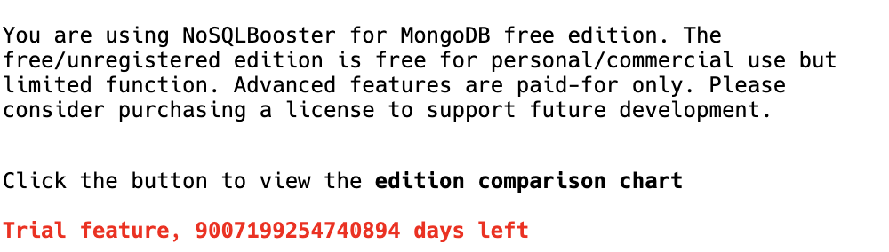

## nosqlbooster

### TL;DR

直接下载我重新打包好的文件替换 [app.asar](https://github.com/yunyu950908/tools/releases/tag/nosqlbooster%2Fv0.0.1-alpha) (记得先备份原文件)

### 手动修改

原理比较简单, 需要验证 VIP 才能使用的功能, 通过 trail + test db 的方式绕过去. (官方提供的高级试用)

需要用到的工具: https://github.com/electron/asar

安装完 asar 后可以查看使用方法

```
Usage: asar [options] [command]

Manipulate asar archive files

Options:
  -V, --version                         output the version number
  -h, --help                            display help for command

Commands:
  pack|p [options] <dir> <output>       create asar archive
  list|l [options] <archive>            list files of asar archive
  extract-file|ef <archive> <filename>  extract one file from archive
  extract|e <archive> <dest>            extract archive
  *
  help [command]                        display help for command
```

以 mac 为例, asar 在目录 `/Applications/NoSQLBooster for MongoDB.app/Contents/Resources`

```
export ASAR_PATH="/Applications/NoSQLBooster for MongoDB.app/Contents/Resources"

# 记得先备份
cp $ASAR_PATH/app.asar $ASAR_PATH/app.asar.backup

# 然后解包
asar extract $ASAR_PATH/app.asar $ASAR_PATH/dest
```

解包后就可以看到源代码啦, 虽然压缩混淆过, 不少稍微花点时间看看还是很容易发现一些端倪的. 发现端倪之后就开始修改代码啦.

编辑 `lmCore.js` (完整路径 `$ASAR_PATH/dest/shared/lmCore.js`), 找变量名 `TRIAL_DAYS`, 直接拉满.

```
  MAX_TRIAL_DAYS = Number.MAX_SAFE_INTEGER,
  TRIAL_DAYS = Number.MAX_SAFE_INTEGER
```

到这里只是把 trial 天数拉满, 高级功能还不能自如使用.


根据弹出 trial 用户只能在 test 数据库才能使用高级功能这个提示, 去搜索关键字, 找到对应的代码.

编辑 `schemaCommonWindow.js` (完整路径 `$ASAR_PATH/dest/frontend/schemaExplorer/schemaCommonWindow.js`), 找到 `if (t.db === utils_1.consts.__test_db) return` 

```
// 分析一下上下文, 这里直接 return false 就行了.
  let e = () => {
    return false
    // if (t.db === utils_1.consts.__test_db) return
    // if (!utils_1.cl()) {
    //   t.db = 'test'w
    //   return true
    // }
  }
```

最后重新打包

```
asar pack $ASAR_PATH/dest $ASAR_PATH/dest.asar
```

别忘了把打包后的 dest.asar 替换成 app.asar

重新启动 nosqlbooster, 高级功能就都能使用啦.

以上.